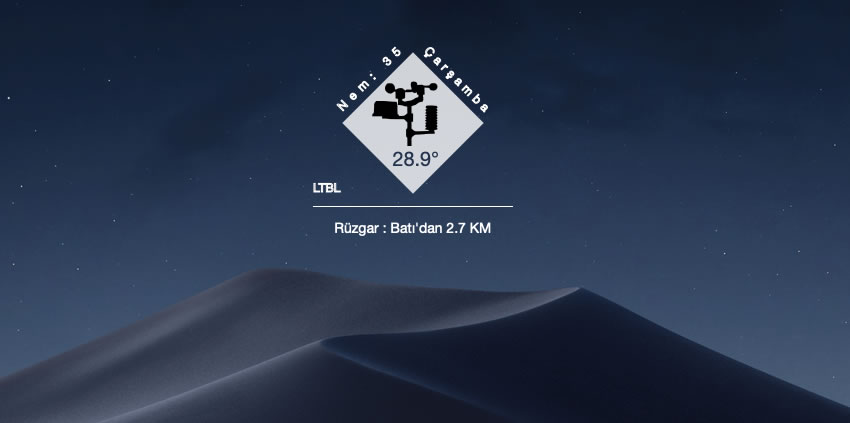

# Übersicht APRS.FI WX Weather Widget

Made for [Übersicht](http://tracesof.net/uebersicht/)

Uses the  the [aprs.fi](https://aprs.fi/page/api "aprs.fi api") to obtain the weather information.

## Options

You can find all options `index.coffee` at the top of the file:

Default city and region. You can replace `<city>` with your city. This location is used in case the automatic location lookup fails.

## Appearance

To tweak the appearance, just follow the directions inside `index.coffee`. 
